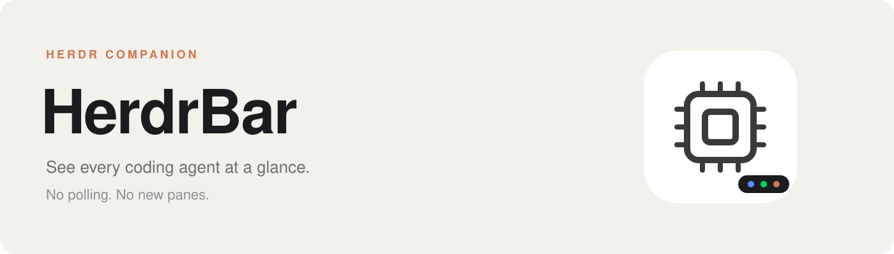
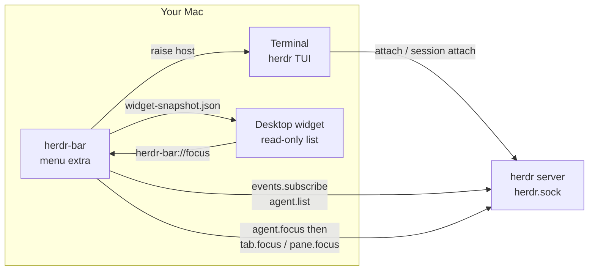

# herdr-bar

[English](README.md) · [中文](README.zh.md) · [Docs](https://openalon.com/herdr-bar/)

**A Herdr companion in the menu bar**

See every coding agent at a glance. Jump to the one that needs you. No polling. No new panes.

[Install](https://openalon.com/herdr-bar/guide/installation.html) · [Changelog](https://openalon.com/herdr-bar/changelog.html)

<table>
  <tr>
    <th align="center">👁 <a href="https://openalon.com/herdr-bar/guide/usage.html">Menu-bar glance</a></th>
    <th align="center">⚡ <a href="https://openalon.com/herdr-bar/guide/protocol.html">Event-driven</a></th>
    <th align="center">🎯 <a href="https://openalon.com/herdr-bar/guide/status.html">Priority focus</a></th>
  </tr>
  <tr>
    <td>Done and Working stay on the extra. Blocked and Unknown join when they need you. Idle lives behind the dashboard eye.</td>
    <td><code>events.subscribe</code> invalidates the snapshot; <code>agent.list</code> refreshes it. Never poll Herdr on a timer.</td>
    <td>Option-click jumps to the highest-priority agent — blocked, then done, working, unknown, idle.</td>
  </tr>
  <tr>
    <th align="center">🪟 <a href="https://openalon.com/herdr-bar/guide/architecture.html#focus-raiser">Focus, never create</a></th>
    <th align="center">🧩 <a href="https://openalon.com/herdr-bar/guide/architecture.html#discovery">Every live session</a></th>
    <th align="center">🎨 <a href="https://openalon.com/herdr-bar/guide/configuration.html">Claude Code palette</a></th>
  </tr>
  <tr>
    <td><code>agent.focus</code>, then <code>tab.focus</code> so the attached TUI follows, then raise that session’s host terminal. Never open a window, pane, or agent.</td>
    <td>Discover default and named sessions (<code>work</code>, …) and identify agents as <code>(sessionName, pane_id)</code>.</td>
    <td>Defaults match Claude’s terminal tabs; working uses the CLI spinner terracotta. Override from the gear.</td>
  </tr>
</table>

> **What this is**
>
> **herdr-bar** is the macOS menu-bar companion for [Herdr](https://herdr.dev/). It talks to Herdr’s Unix sockets, folds every live session into a glanceable count, and jumps you back to a pane that already exists.
>
> Requires Herdr 0.8+ and macOS 13+. The app is an `LSUIElement` — it never appears in the Dock.

  
  
  

## What it is

Herdr owns the agents. The terminal owns the TUI. herdr-bar is the glance in between — it never starts Herdr and never creates a pane.

Without it you attach each session and hunt for the pane that needs you. With it: Option-click the extra for the highest-priority agent, or open the dashboard and click a row.

## FAQ

**What is herdr-bar?**
A macOS menu-bar extra for [Herdr](https://herdr.dev/). It does not start Herdr. It discovers `herdr.sock`, shows Done / Working counts, and Option-click focuses the highest-priority agent.

**How do I install it?**
Download a tagged `HerdrBar-*-macos.zip` from [GitHub Releases](https://github.com/openalon-org/herdr-bar/releases), or `./scripts/install.sh` from source. The zip is ad-hoc signed — first launch may need right-click → Open. Details: [Install](https://openalon.com/herdr-bar/guide/installation.html).

**Does it create new panes?**
No. Focus is `agent.focus`, then `tab.focus` / `pane.focus` so the attached TUI follows, then raising the host terminal. See [Usage](https://openalon.com/herdr-bar/guide/usage.html) and [Architecture](https://openalon.com/herdr-bar/guide/architecture.html).
