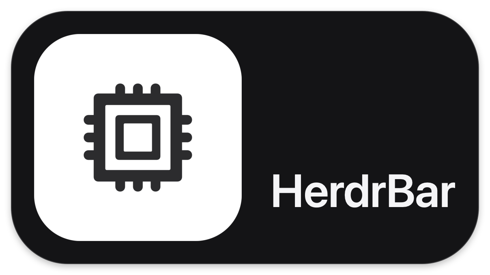
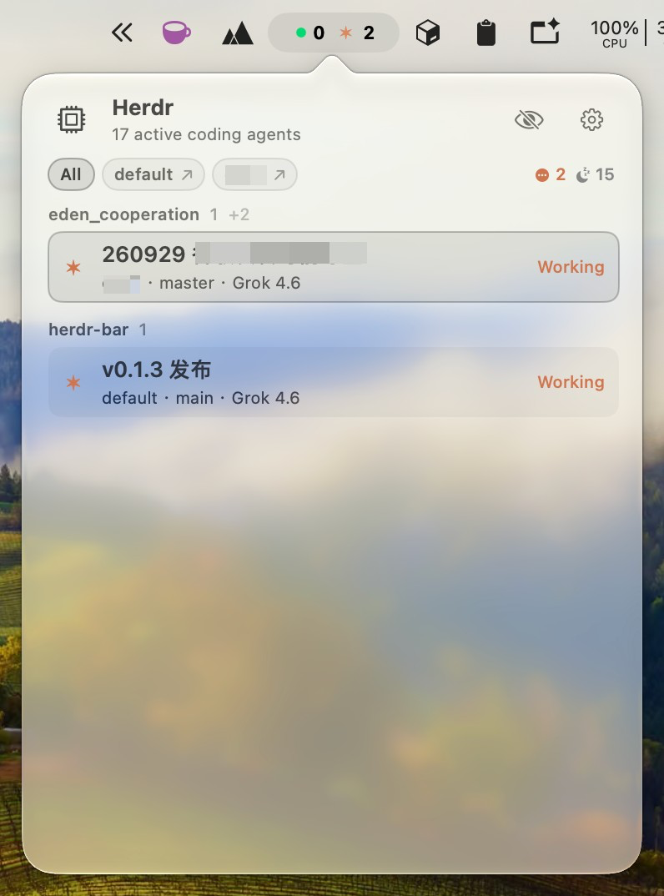
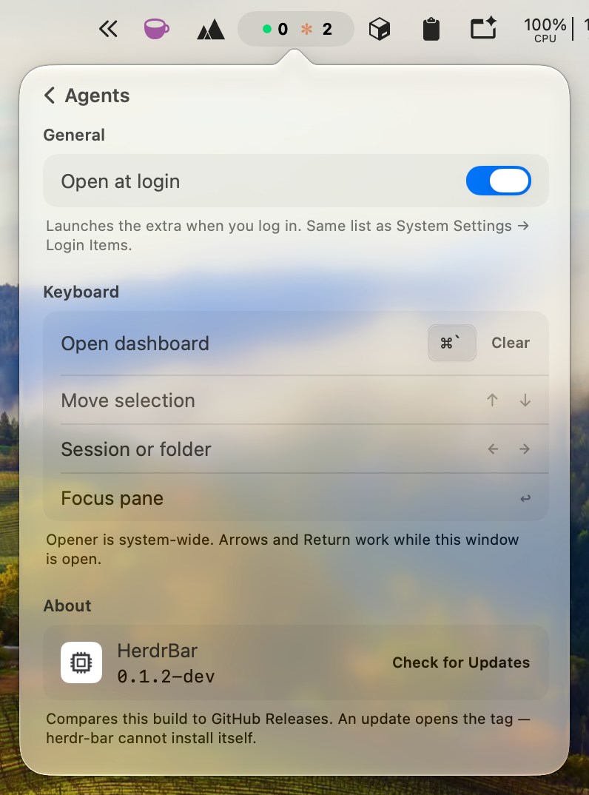
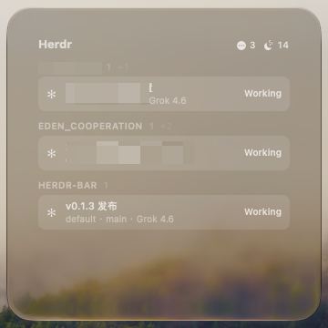
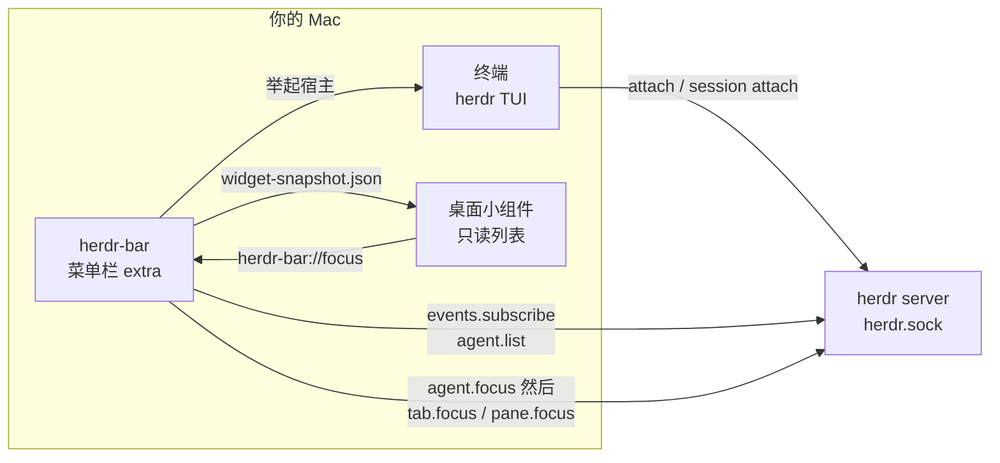

# herdr-bar

[English](README.md) · [中文](README.zh.md) · [文档](https://openalon.com/herdr-bar/zh/)

**菜单栏上的 Herdr 伴侣**

一眼看到每个 coding agent。跳到最需要你的那个。不轮询，不新建 pane。

[开始安装](https://openalon.com/herdr-bar/zh/guide/installation.html) · [更新日志](https://openalon.com/herdr-bar/zh/changelog.html)

  

| 👁 [菜单栏一览](https://openalon.com/herdr-bar/zh/guide/usage.html) | ⚡ [事件驱动](https://openalon.com/herdr-bar/zh/guide/protocol.html) | 🎯 [优先级聚焦](https://openalon.com/herdr-bar/zh/guide/status.html) |
|---|---|---|
| Done / Working 常驻菜单栏。Blocked / Unknown 有人时才出现。Idle 不占菜单栏，藏在仪表盘的眼睛后面。 | 通过 Herdr 的 `events.subscribe` 失效快照，再用 `agent.list` 刷新。从不按定时器轮询。 | Option-click 跳到最高优先级 agent：blocked → done → working → unknown → idle。 |
| **🪟 [只聚焦，不创建](https://openalon.com/herdr-bar/zh/guide/architecture.html#focus-raiser)** | **🧩 [每个 live session](https://openalon.com/herdr-bar/zh/guide/architecture.html#discovery)** | **🎨 [Claude Code 调色板](https://openalon.com/herdr-bar/zh/guide/configuration.html)** |
| 调用 `agent.focus`，再 `tab.focus` 让已经 attach 的 TUI 跟过去，然后举起宿主终端。从不新开窗口、pane 或 agent。 | 同时发现 default 与 named session（如 `work`），按 `(sessionName, pane_id)` 聚合身份。 | 默认颜色跟 Claude 终端 tab 对齐；working 用 CLI spinner 陶土色。齿轮里可覆盖。 |

> **这是什么**
>
> **herdr-bar** 是 [Herdr](https://herdr.dev/) 的 macOS 菜单栏伴侣。它直接连 Herdr 的 Unix socket，把多个 live session 里的 coding agent 收成一眼能读的计数，并让你跳回已经存在的 pane。
>
> 需要 Herdr 0.8+ 和 macOS 13+。应用是 `LSUIElement`，不出现在 Dock。

  
  
  

## 这是什么

Herdr 管 agent。终端管 TUI。herdr-bar 是中间那一眼 — 不启动 Herdr，也不新建 pane。

没有它，你得自己 attach 每个 session，再在 pane 里找谁在等你。有了它：Option-click extra 跳到最高优先级 agent，或打开仪表盘点一行。extra 举起已经在跑那个 session 的终端。

## 常见问题

**herdr-bar 是什么？**
[Herdr](https://herdr.dev/) 的 macOS 菜单栏 extra。它不启动 Herdr，只发现 `herdr.sock`，显示 Done / Working 计数，Option-click 聚焦最高优先级 agent。

**怎么安装？**
从 [GitHub Releases](https://github.com/openalon-org/herdr-bar/releases) 下载带 tag 的 `HerdrBar-*-macos.zip`，或从源码跑 `./scripts/install.sh`。zip 是 ad-hoc 签名，第一次可能要右键 → 打开。详见 [安装](https://openalon.com/herdr-bar/zh/guide/installation.html)。

**会新建 pane 吗？**
不会。聚焦是 `agent.focus`，再 `tab.focus` / `pane.focus` 让已经 attach 的 TUI 跟过去，然后举起宿主终端。见 [使用](https://openalon.com/herdr-bar/zh/guide/usage.html) 和 [架构](https://openalon.com/herdr-bar/zh/guide/architecture.html)。
