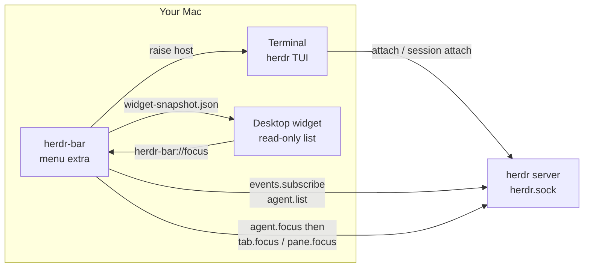

::: info What this is
**herdr-bar** is the macOS menu-bar companion for [Herdr](https://herdr.dev/). It talks to Herdr’s Unix sockets, folds every live session into a glanceable count, and jumps you back to a pane that already exists.

Requires Herdr 0.8+ and macOS 13+. The app is an `LSUIElement` — it never appears in the Dock.
:::

  <figure class="shot">
    
    <figcaption>Dashboard</figcaption>
  </figure>
  <figure class="shot">
    
    <figcaption>Settings</figcaption>
  </figure>
  <figure class="shot">
    
    <figcaption>Widget</figcaption>
  </figure>

## What it is {#what}

Herdr owns the agents. The terminal owns the TUI. herdr-bar is the glance in between — it never starts Herdr and never creates a pane.

Without it you attach each session and hunt for the pane that needs you. With it: Option-click the extra for the highest-priority agent, or open the dashboard and click a row.

## FAQ

**What is herdr-bar?**
A macOS menu-bar extra for [Herdr](https://herdr.dev/). It does not start Herdr. It discovers `herdr.sock`, shows Done / Working counts, and Option-click focuses the highest-priority agent.

**How do I install it?**
Download a tagged `HerdrBar-*-macos.zip` from [GitHub Releases](https://github.com/openalon-org/herdr-bar/releases), or `./scripts/install.sh` from source. The zip is ad-hoc signed — first launch may need right-click → Open. Details: [Install](/guide/installation).

**Does it create new panes?**
No. Focus is `agent.focus`, then `tab.focus` / `pane.focus` so the attached TUI follows, then raising the host terminal. See [Usage](/guide/usage) and [Architecture](/guide/architecture).
